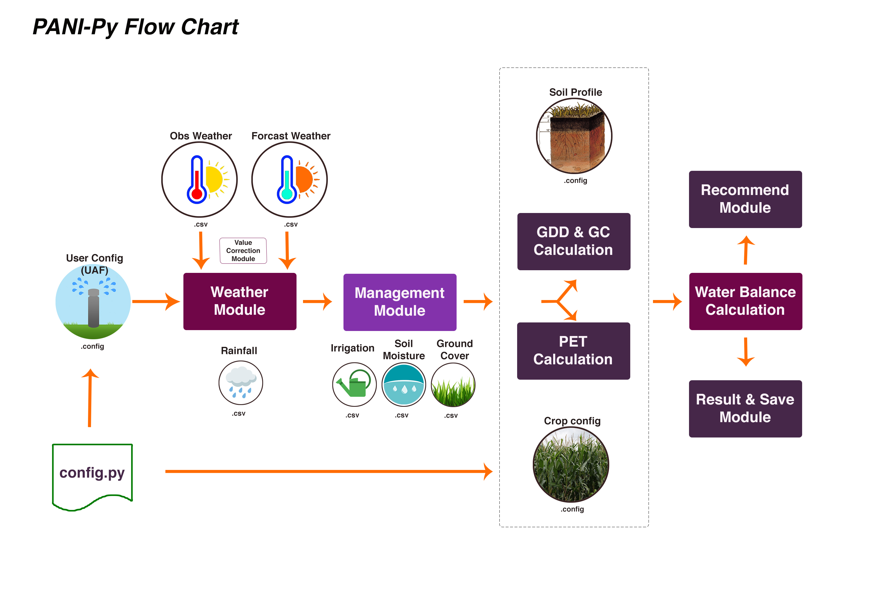

# 🌿 PyPani 🌿

[](https://opensource.org/licenses/MIT)
[](https://www.python.org/downloads/)
[](https://github.com/malfihasan/PyPani/issues)

## Overview

"PyPani" is a Python package that provides irrigation scheduling based on weather, soil, vegetation stage, and crop types. It can be incorporated with a real-time forecasting model with sufficient environmental information and can simplistically recommend irrigation requirements to farmers and small agriculture stakeholders. The module concept was originally proposed by an international group of research institutes [1] in a project named "[The STARS Project](https://www.stars-project.org/en/about-us/the-stars-project/)". Later, the International Wheat and Maize Improvement Center (CIMMYT) Bangladesh extended the idea, leading to the development of this model for Python users.

## Features

- 🌤️ **Weather Module**: Integrates observed and forecasted weather data. Supports daily weather data with a seven-day weather forecast. Requires daily maximum and minimum temperature (°C) and rainfall (mm). Currently, it supports per year-based prediction with a planting date for a single growing season for a single crop.
- 🌱 **Management Module**: Defines soil type, moisture level input, and prior irrigation. Supports various depths of the aquifer through 'config' to facilitate the modeling operation.
- 📈 **Calculation Module [GDU and PET Module]**: Calculates the aggregated growing degree day (GDU) values from planting and determines evapotranspiration based on the selected equation. Supports Penman–Monteith Equation, Priestley–Taylor, and Blainy-Criddle Equation.
- 💧 **Recommendation Module**: Generates daily crop water use and provides next week's irrigation recommendations based on forecast data.



## Installation Guide

The package can be installed as a regular Python package. The supported Python version is 3.8.2.

### Check Python Version:
```bash
pip --version
```

### Install the Package:
```bash
pip install git+https://github.com/malfihasan/PyPani.git#egg=PyPani
```

## Usage

### Example Run

To run the model manually:
```bash
python model.py 03/10/2018 322/2017
```

To build and test the package:
```bash
pip3 install -e .
```

Example data can be found in the "tests" folder.

## Contact

For further information or questions, please contact:

- Dr. M. Alfi Hasan - [mdalfihasan19@gmail.com](mailto:mdalfihasan19@gmail.com) - [malfihasan.com](http://www.malfihasan.com/)
- Dr. Urs Christoph Schulthess - [U.Schulthess@cgiar.org](mailto:U.Schulthess@cgiar.org)

Distributed under the MIT license. See LICENSE.txt for more information.

## References

[1] Collaborative partners:
- The International Maize and Wheat Improvement Center (CIMMYT) in Bangladesh and Mexico
- The Commonwealth Scientific and Industrial Research Organisation (CSIRO) in Australia
- The International Crops Research Institute for the Semi-Arid Tropics (ICRISAT) in Mali and Nigeria
- The University of Maryland, USA, in Tanzania and Uganda
- M. Alfi Hasan - Independent consultant - Affiliated with the University of Rhode Island.
